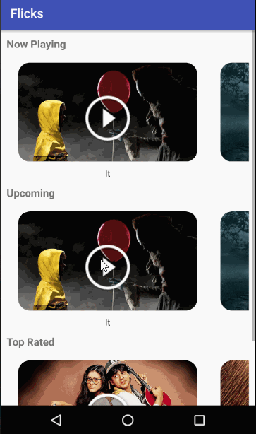

# Project 1 - *Flicks*

**Flicks** shows the latest movies currently playing in theaters. The app utilizes the Movie Database API to display images and basic information about these movies to the user.

Time spent: **25** hours spent in total

## User Stories

The following **required** functionality is completed:

* [X] User can **scroll through current movies** from the Movie Database API
* [X] Layout is optimized with the [ViewHolder](http://guides.codepath.com/android/Using-an-ArrayAdapter-with-ListView#improving-performance-with-the-viewholder-pattern) pattern.
* [X] For each movie displayed, user can see the following details:
  * [X] Title, Poster Image, Overview (Portrait mode)
  * [X] Title, Backdrop Image, Overview (Landscape mode)

The following **optional** features are implemented:

* [X] Display a nice default [placeholder graphic](http://guides.codepath.com/android/Displaying-Images-with-the-Picasso-Library#configuring-picasso) for each image during loading.

The following **bonus** features are implemented:

* [X] Allow user to view details of the movie including ratings and popularity within a separate activity or dialog fragment.
* [X] When viewing a popular movie (i.e. a movie voted for more than 5 stars) the video should show the full backdrop image as the layout.  Uses [Heterogenous ListViews](http://guides.codepath.com/android/Implementing-a-Heterogenous-ListView) or [Heterogenous RecyclerView](http://guides.codepath.com/android/Heterogenous-Layouts-inside-RecyclerView) to show different layouts.
* [X] Allow video trailers to be played in full-screen using the YouTubePlayerView.
    * [X] Overlay a play icon for videos that can be played.
    * [X] More popular movies should start a separate activity that plays the video immediately.
    * [X] Less popular videos rely on the detail page should show ratings and a YouTube preview.
* [X] Apply the popular [Butterknife annotation library](http://guides.codepath.com/android/Reducing-View-Boilerplate-with-Butterknife) to reduce boilerplate code.
* [X] Apply rounded corners for the poster or background images using [Picasso transformations](https://guides.codepath.com/android/Displaying-Images-with-the-Picasso-Library#other-transformations)
* [X] Replaced android-async-http network client with the popular [OkHttp](http://guides.codepath.com/android/Using-OkHttp) networking libraries.

The following **additional** features are implemented:

* [X] Show the list of movies in a horizontal layout under each category (Now Playing, Upcoming, Top Rated supported currently). This gives a better user experience by giving users choice to view information about a specific category.
* [X] For each category, show the next item in the list partially. This would act as a cue to the user that there are more items to view and to swipe horizontally to bring them in on screen.

## Video Walkthrough

Here's a walkthrough of implemented user stories:

GIF created with [LiceCap](http://www.cockos.com/licecap/).

## Notes

Describe any challenges encountered while building the app.
1. okHttp and executing async requests in a different class that cannot access MainActivity (currently moved the code to MainActivity with okHttp executing requests asynchronously)
2. On a horizontal list layout, showing the next item in the list partially on the screen. The messaging to indicate that there are items following the currently visible item that are outside the screen is particularly challenging if any icons/indicators are not used.
3. Deciding on the optimum image size to display on a screen to allow for better whitespace and content balance.

## Open-source libraries used

- [Picasso](http://square.github.io/picasso/) - Image loading and caching library for Android
- [okHttp](http://square.github.io/okhttp/) - An HTTP & HTTP/2 client for Android and Java applications
- [Gson](https://github.com/google/gson) - A Java serialization/deserialization library to convert Java Objects into JSON and back

## License

    Copyright [yyyy] [name of copyright owner]

    Licensed under the Apache License, Version 2.0 (the "License");
    you may not use this file except in compliance with the License.
    You may obtain a copy of the License at

        http://www.apache.org/licenses/LICENSE-2.0

    Unless required by applicable law or agreed to in writing, software
    distributed under the License is distributed on an "AS IS" BASIS,
    WITHOUT WARRANTIES OR CONDITIONS OF ANY KIND, either express or implied.
    See the License for the specific language governing permissions and
    limitations under the License.